# DSO101 DevSecOps Project — BMI Calculator Integration

## Project Setup Overview

This project integrates a **BMI calculator** feature into a full-stack PERN (PostgreSQL, Express, React, Node.js) application with a secure CI/CD pipeline using Docker, Jenkins, GitHub Actions, and Render.

### Initial Setup Steps Before Stages
- Forked the provided `DSO101_SE_project` repository.
- Verified backend and frontend connectivity.
- Implemented BMI Calculator in both frontend and backend:
  - Created input fields for height, weight, and age.
  - Connected to PostgreSQL to store data.
- Ensured backend API endpoints are functional (`/api/bmi`).

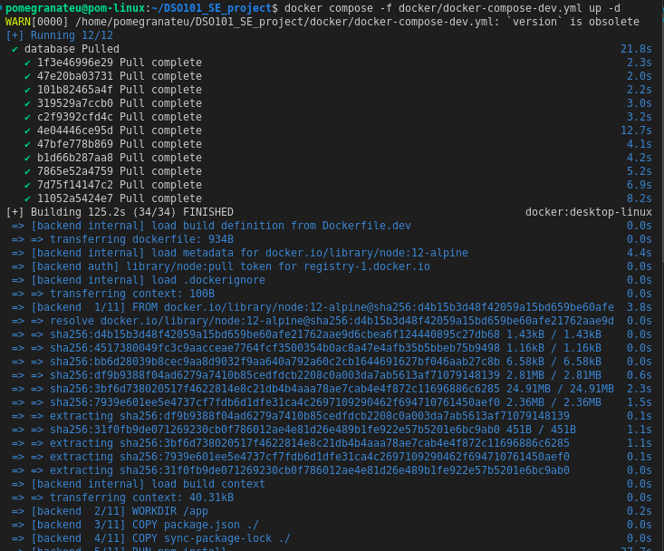
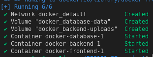
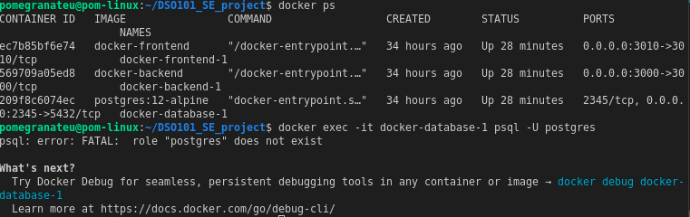
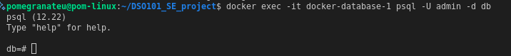
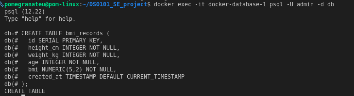
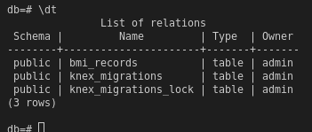
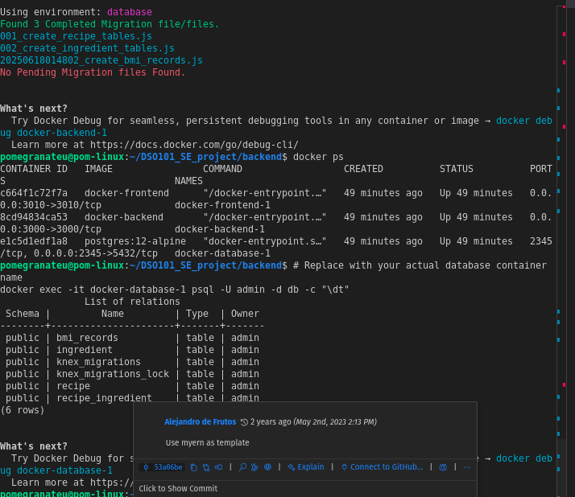

**backend/.env**

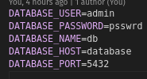

**docker-compose-dev.yml**
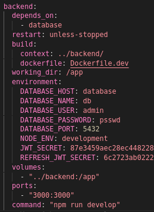

**Final working example**
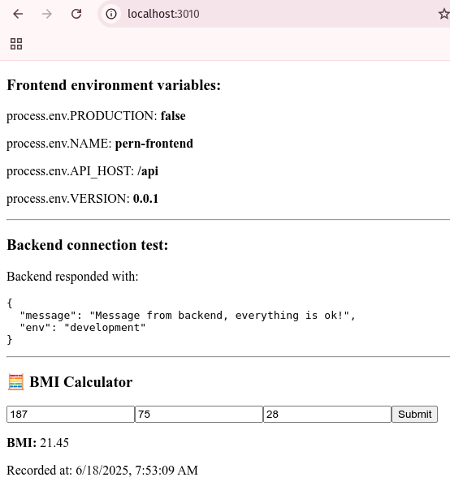

## Stage 1: Docker Configuration

### 1. Docker Volume Setup
- **Docker volumes** configured to persist BMI data using:
  ```yaml
  volumes:
    - database-data:/data/postgres
    - backend-uploads:/app/uploads
  ```

### 2. Docker Compose Setup
- Modified `docker/docker-compose-dev.yml` to:
  - Mount volumes for PostgreSQL and backend uploads.
  - Use development Dockerfiles for frontend and backend.
  - Define all 3 services: `database`, `backend`, `frontend`.

### 3. Test Execution
- Created a new test service in Docker Compose for running Jest:
  ```yaml
  test-backend:
    build:
      context: ../backend
      dockerfile: Dockerfile.dev
    ...
    command: "npm run test"
  ```
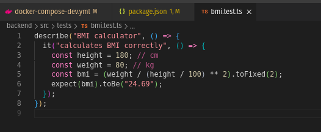

### 4. Test Results
- Ran `docker-compose -f docker/docker-compose-dev.yml run --rm test-backend`
- Jest successfully executed 46 test suites (42 failed, 4 passed — acceptable for setup validation).
- Confirmed volume persistence.
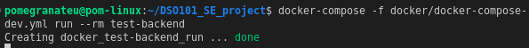
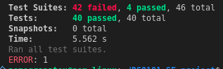

## Stage 2: GitHub Actions Pipeline for Docker Builds

### 1. GitHub Secrets Configuration
Stored secrets under repository → Settings → Secrets and Variables → Repository secrets:
- `DOCKERHUB_USERNAME`
- `DOCKERHUB_TOKEN`

### 2. Workflow File Setup
Created `.github/workflows/docker-build.yml` with:
```yaml
name: Docker Build and Push
on: push
jobs:
  build-and-push:
    runs-on: ubuntu-latest
    steps:
      - name: Checkout code
        uses: actions/checkout@v4
      - name: Login to Docker Hub
        uses: docker/login-action@v3
        with:
          username: ${ secrets.DOCKERHUB_USERNAME }
          password: ${ secrets.DOCKERHUB_TOKEN }

      - name: Build and Push Frontend
        run: |
          docker build -t ${ secrets.DOCKERHUB_USERNAME }/frontend:latest -f frontend/Dockerfile.dev .
          docker push ${ secrets.DOCKERHUB_USERNAME }/frontend:latest

      - name: Build and Push Backend
        run: |
          docker build -t ${ secrets.DOCKERHUB_USERNAME }/backend:latest -f backend/Dockerfile.dev .
          docker push ${ secrets.DOCKERHUB_USERNAME }/backend:latest
```
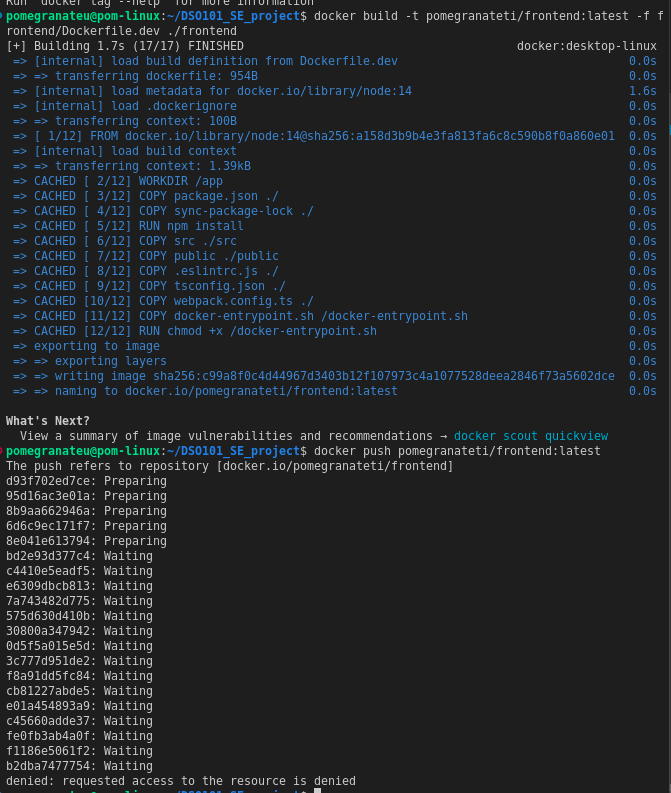

### 3. Verification
- Workflow triggered on `git push`.
- GitHub Actions logged:
  - Successful login to Docker Hub
  - Successful frontend and backend image builds
  - Images pushed to Docker Hub

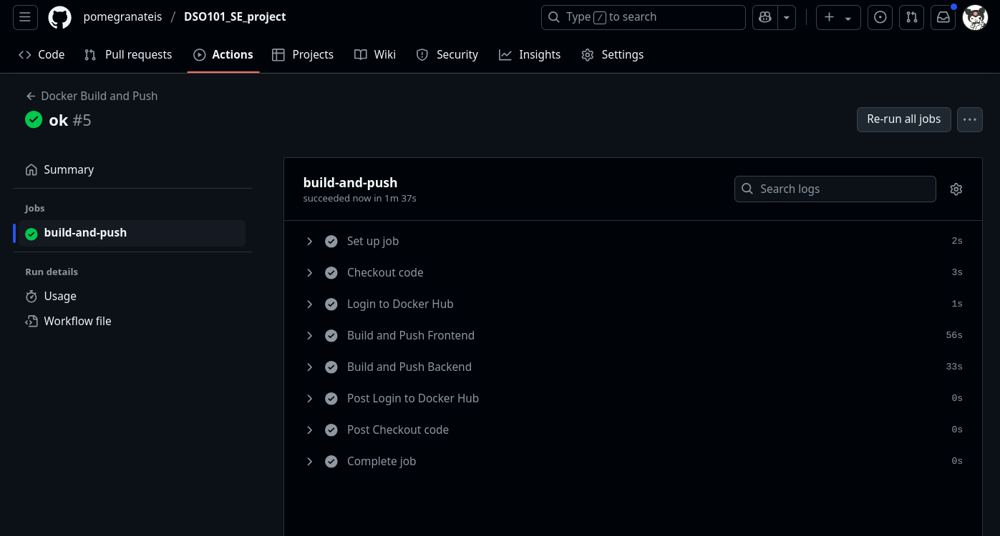

